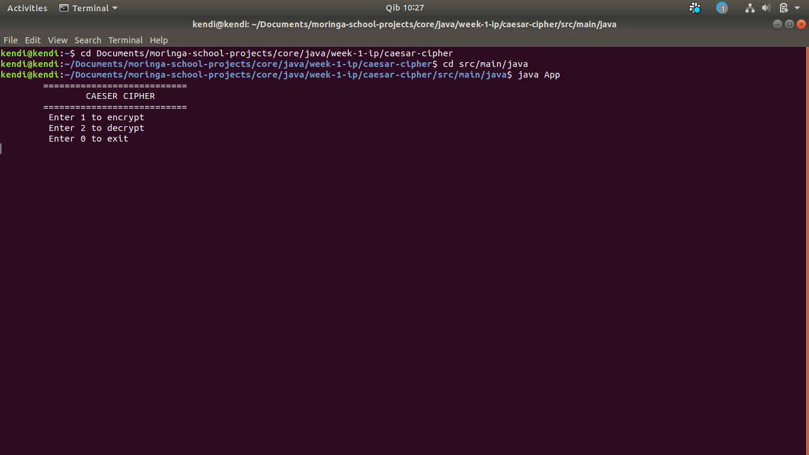

# CAESAR CIPHER
#### v1, as of, 7th October, 2019

### BY: Sharon Ivy Kendi M.

## DESCRIPTION:
   A Caesar cipher is a type of substitution in which each letter is shifted a certain number of places also known as a key, down the alphabet.  For example, with a shift of 1, A would be replaced by B, B would become C, and so on.

## Built With:
  * [Java](https://www.java.com/)
  * [Intellij Idea](https://www.jetbrains.com/idea/)

## Specifications:
  **(using Behaviour Driven Development )**
   Behavior: <br>*The program should:*       | Input:    | Output:     |
  |:-------------|:------------- |:-------------|
  | Take in a word from the user | Run | You entered: Run    |
  | Take a key entered by user   | 1 | You entered: 1 |
  | Encrypt the entered word using the given key   | Run | Svo |
  |  Take in an encrypted word from the user  | Svo | You entered: Svo |
  | Take a key entered by user   | 1 | You entered: 1 |
  | Decrypt the entered word using the given key   | Svo | Run |

## Pre-requisites:
  You need the following installed on your machine
    - Java
    - Java Development Kit(JDK)
  To confirm run the following command on your Linux command line:
    ```
    $ java -version
    ```

## Demo:
  
  
## Project setup requirements:
  * See pre-requisites
  * Fork this repository
  * Run the command;
  'git clone https://github.com/SharonIvy/githubsearch.git' to clone

## Set-up process:
  * Having cloned this repository to your local machine navigate to the folder you cloned into and open the terminal from there.

  * Run the following commands on your LInux command line:
    ```
    $ cd src/main/java
    $ java App

 ### Running Tests;
  **This is a sample test that tests if the getter method works:**
  ```
  @Test
  public void ceaseCipher_getmWord_String(){
    CeaserCipher testCeaser = new CeaserCipher("Hell0",1);
    assertEquals("Hello", testCeaser.getmWord());
  }
  ```
## License:
  MIT License
    Copyright (c) 2018 **Sharon Ivy Kendi M.**
  
## Support and contact details:
  e-mail; kendishivy72@gmail.com